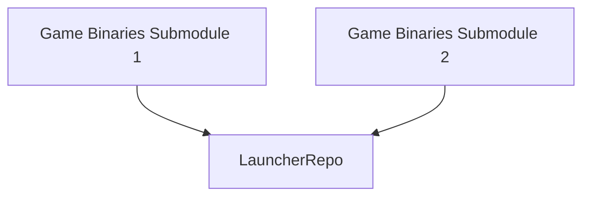

# ArcadeMachineApplication
 Navigates between and executes games presented at Forsbergs Christmas Market 2024

## Stack
* WPF (xaml and csharp)
* Packages like: wpfgif, wpfjson

## Example UI layout 

## Diagram of system structure:

## How it works:
* The authors give access to their binary repo (with a structure described later), so a submodule of it can be added to this repo
* The launcher presents the games made by the authors, navigating between the submodule directories

## Binary repo structure:
* The build folder created your engine of choice
* With a .gif file representing your game
* With a metadata.json file with filled values, the keys defined by this project however
* With a license

## Notes:
* Your private repos (the submodules) will be unavailible though this repo is public, so don't worry about that!

